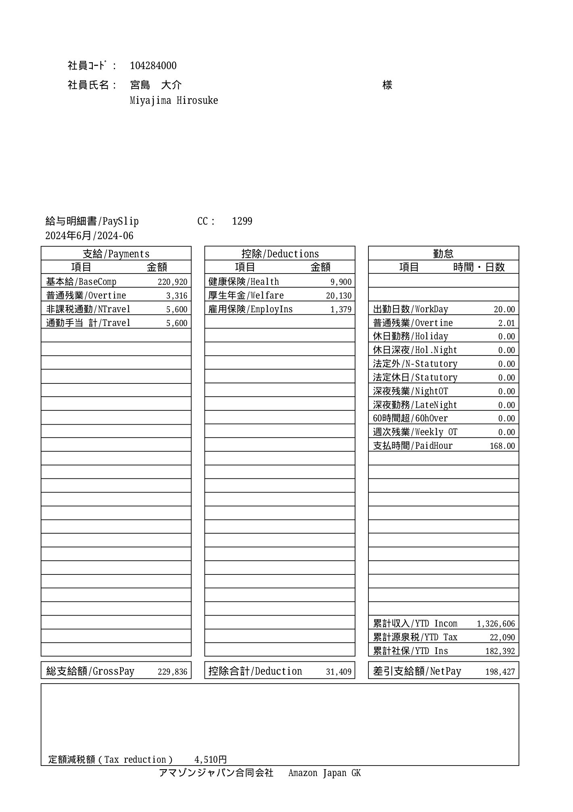

# payday-jun2024

### June 24, 2024 

##### 給与明細書 
- Payroll(給与明細書照会システム)にて6月分給与明細書を照会している動画です。
  - https://kangdaegae.web.fc2.com/misc/ipoint/2024/jun24-p1.mp4
- ※私の社員番号がこのような数字であることを確かめるにはアマゾンの社内用パソコンにて下記にアクセスしてみて下さい: 
  - https://fclm-portal.amazon.com/employee/activityDetails/ppa?employeeId=hirosuk&warehouseId=KIX3
- 

##### 出勤日数 及び 有給休暇使用日数 
- 2024年5月の出勤日数は20であり、有給休暇(パーソナル休暇)は5月24日(給料日)の1日のみに使用しました。
  - 計算式: 支払時間(PaidHour) = (20 + 1) * 8.0 = 168.0
  - https://kangdaegae.web.fc2.com/misc/ipoint/2024/jun24-p2.mp4
